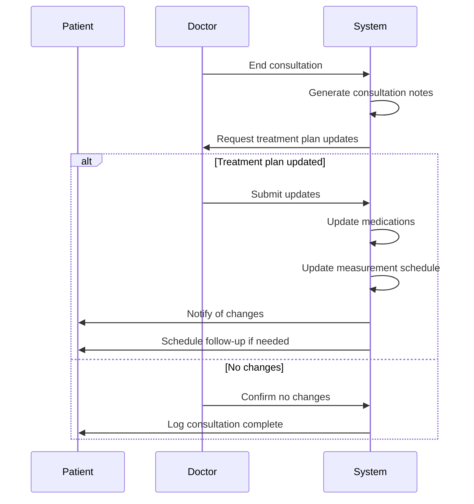

# SPEC-004: Telemedicine Integration Module

**Parent:** SPEC-001
**Module:** Healthcare Provider Consultation
**Version:** 1.0.0
**Date:** 2026-02-07

---

## 1. Overview

This module enables patients to schedule and conduct consultations with healthcare providers, either in-person or via video call. It integrates with the patient's health data to provide context for the consultation.

---

## 2. Consultation Types

| Type | Description | Duration | Features |
|------|-------------|----------|----------|
| IN_PERSON | Physical visit to clinic | 30 min | Location, directions, calendar |
| VIDEO_CALL | Remote video consultation | 20 min | Video SDK, screen sharing for data |
| ASYNC_MESSAGE | Text-based consultation | 48h response | Chat, file attachments |

---

## 3. User Stories (EARS Format)

| ID | Requirement | Acceptance Criteria |
|----|-------------|---------------------|
| TM-001 | WHEN health data shows concerning trend, THE SYSTEM SHALL suggest consultation | - Pattern detection for 3+ abnormal readings<br>- Non-intrusive suggestion banner<br>- Dismissible reminder |
| TM-002 | WHEN user requests consultation, THE SYSTEM SHALL show available providers | - Filtered by specialty, location<br>- Available slots within next 7 days<br>- Provider profiles with credentials |
| TM-003 | WHEN user books appointment, THE SYSTEM SHALL add to calendar | - Calendar invite sent<br>- Reminder 24h before<br>- Reschedule option available |
| TM-004 | DURING video consultation, THE SYSTEM SHALL allow data sharing | - Screen sharing capability<br>- Export health summary PDF<br>- Real-time vital signs display |
| TM-005 | AFTER consultation, THE SYSTEM SHALL update treatment plan | - Medication adjustments reflected<br>- New measurement frequencies<br>- Follow-up scheduled if needed |

---

## 4. Provider Network

### 4.1 Provider Types

| Specialty | Conditions Managed |
|-----------|-------------------|
| Endocrinologist | Diabetes, thyroid disorders |
| Cardiologist | Hypertension, heart disease |
| General Practitioner | Primary care, general health |
| Nutritionist | Diet planning for chronic conditions |

### 4.2 Provider Profile

```typescript
interface HealthcareProvider {
  id: string;
  name: string;
  specialties: string[];
  credentials: string[];
  clinicName?: string;
  consultationTypes: ('in_person' | 'video' | 'async')[];
  availability: {
    dayOfWeek: number;
    startTime: string; // HH:mm
    endTime: string;
  }[];
  location?: {
    address: string;
    latitude: number;
    longitude: number;
  };
  rating?: number;
  consultationCount: number;
  languages: string[];
  consultationFee: {
    inPerson?: number;
    video?: number;
    async?: number;
  };
  insuranceAccepted?: string[];
}
```

---

## 5. Appointment Management

```typescript
interface Appointment {
  id: string;
  userId: string;
  providerId: string;
  type: 'in_person' | 'video' | 'async';
  status: 'scheduled' | 'confirmed' | 'in_progress' | 'completed' | 'cancelled' | 'no_show';
  scheduledAt: Date;
  duration: number; // minutes
  reason: string;
  notes?: string;
  healthDataSnapshot?: {
    period: '7d' | '30d' | '90d';
    data: HealthSummary;
  };
  videoCallLink?: string;
  reminderSent: boolean;
  createdAt: Date;
}

interface HealthSummary {
  bloodPressure: {
    average: string;
    highest: string;
    lowest: string;
    readings: number;
  };
  glucose: {
    average: number;
    highest: number;
    lowest: number;
    readings: number;
  };
  medicationAdherence: {
    onTime: number; // percentage
    missed: number;
    total: number;
  };
  alertsTriggered: number;
}
```

---

## 6. Video Call Architecture

```
┌─────────────────┐         ┌─────────────────┐
│   Patient App   │         │  Provider Web   │
│   (React Native)│         │   (Browser)     │
└────────┬────────┘         └────────┬────────┘
         │                           │
         │                           │
         └───────────┬───────────────┘
                     │
                     ▼
         ┌───────────────────────┐
         │   Video SDK           │
         │   (Aora/Twilio)       │
         └───────────────────────┘
                     │
                     │
                     ▼
         ┌───────────────────────┐
         │   Backend Server      │
         │   (Token Generation)  │
         └───────────────────────┘
```

### 6.1 Video Features

| Feature | Description |
|---------|-------------|
| HD Video | 720p minimum, adaptive quality |
| Audio | Noise cancellation, echo suppression |
| Screen Share | Patient can share health data charts |
| Recording | Optional, with consent |
| Chat | Text chat during call |
| File Transfer | Share documents during call |

---

## 7. Integration Points

### 7.1 Health Data Export

Before consultation, generate a summary PDF:

```
Health Summary for [Patient Name]
Generated: [Date]

Vital Signs Summary (Last 30 Days)
━━━━━━━━━━━━━━━━━━━━━━━━━━━━━━━━━━━━━━━━━━━━
Blood Pressure: 125/82 mmHg (average)
  - Range: 110/70 - 145/95
  - Readings: 28

Glucose: 105 mg/dL (average)
  - Range: 80 - 135 mg/dL
  - Readings: 42

Medication Adherence: 94%
  - Taken on time: 47
  - Missed: 3
  - Total scheduled: 50

Current Medications
━━━━━━━━━━━━━━━━━━━━━━━━━━━━━━━━━━━━━━━━━━━━
1. Lisinopril 10mg - Once daily at 8:00 AM
2. Metformin 500mg - Twice daily at 8:00 AM, 8:00 PM

Recent Alerts
━━━━━━━━━━━━━━━━━━━━━━━━━━━━━━━━━━━━━━━━━━━━
- High blood pressure reading (Jan 15) - Resolved
- Missed medication (Jan 12) - Acknowledged
```

---

## 8. Post-Consultation Workflow



---

## 9. Payment Integration

```typescript
interface ConsultationPayment {
  appointmentId: string;
  amount: number;
  currency: string;
  method: 'insurance' | 'credit_card' | 'paypal';
  insuranceInfo?: {
    provider: string;
    memberId: string;
    preAuthorization?: string;
  };
  status: 'pending' | 'paid' | 'refunded';
}
```

---

**Dependencies:** SPEC-001 (Core App)
**Related:** SPEC-003 (Emergency Alerts - for alert-triggered consultations)
